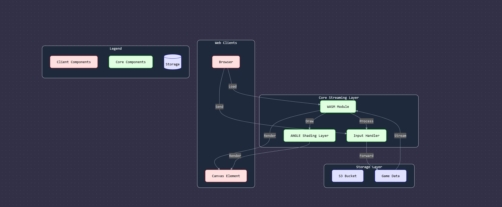
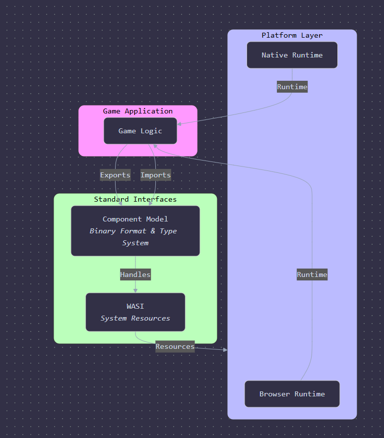

# Layer-W - Near Native Web Execution Layer for Games

## Component Roles

### How would a streaming layer would work with WASI, Wasm Component Model, and platform specific shading layers?

1. Web Clients Layer
   - Browser: Loads and manages the WASM module
   - Canvas Element: Provides the rendering surface for game frames
2. Core Streaming Layer
   - WASM Module: Contains the game logic compiled to WebAssembly
   - ANGLE Shading Layer: Handles GPU-accelerated rendering of frames to platform specific language, selected from
   - Input Handler: Processes client inputs and forwards them to the game
3. Storage Layer
   - S3 Bucket: Stores the compiled WASM modules and game assets
   - Game Data: Contains the actual game state and frame data

## Data Flow

### The streaming process works in three main cycles:

1. Frame Rendering Cycle
   - Game Data → WASM Module → ANGLE Shading Layer → Canvas Element
   - Each frame is processed through ANGLE for GPU-accelerated rendering
2. Input Processing Cycle
   - Browser → Input Handler → Game Data
   - Client inputs are processed and forwarded to update game state
3. Asset Loading Cycle
   - S3 Bucket → WASM Module → Browser
   - Initial game assets and WASM modules are loaded on startup
   - This architecture allows your game to stream efficiently to any web-enabled device without requiring downloads or complex infrastructure. The WASM component model ensures platform independence, while ANGLE or similar AOT platform specific compilation handles cross-platform rendering compatibility.

## How is it better than having a normal distributed server architecture?

### The streaming architecture using WASI, the WASM Component Model, and platform-specific shading layers like ANGLE provides several key advantages over a traditional distributed stack. Here's how and why:

1. True Platform Independence

   - WASM + Component Model: Enables components compiled from any language (C++, Rust, etc.) to run safely in any compliant runtime—browser or server.
   - WASI (WebAssembly System Interface): Abstracts OS-level dependencies like file I/O, sockets, and clocks, allowing the same WASM module to run on Windows, macOS, Linux, or even embedded systems.
   - Benefit: You don't need to recompile or redesign per platform or architecture—write once, deploy anywhere.

2. Ultra-Light Client Experience

   - No Full Downloads Needed: Clients stream assets and logic only as needed (like video streaming).
   - Fast Boot: The app loads and runs faster because everything is chunked and streamed on demand.
   - Benefit: Lower barriers for users (especially mobile or low-power devices) and better user acquisition metrics.

3. GPU-Accelerated, Cross-Platform Rendering with ANGLE

   - ANGLE: Translates WebGL/OpenGL ES to platform-specific APIs like Direct3D, Metal, or Vulkan - or similar AOT platform specific compilation.
   - Benefit: Developers code once in WebGL/OpenGL ES, and ANGLE ensures it runs optimally across all GPUs and OSes without vendor-specific shaders.

4. Simplified Infrastructure & Maintenance

   - No Backend Logic Duplication: Game logic lives in the WASM module and runs identically on all clients.
   - Fewer Services to Maintain: Unlike traditional distributed stacks (which need multiple microservices and translation layers), this system keeps it clean: load assets, stream frames, sync inputs.

5. Security & Isolation by Design

   - WASM Sandbox: Memory-safe, runtime-verified execution environment.
   - WASI Constraints: System-level access is opt-in and well-defined.
   - Benefit: Smaller attack surface and easier compliance with security policies than exposing traditional APIs.

6. Better Scalability for Live Streaming & Real-time Games

   - Stateless, Streamed Execution: Because the game logic and rendering can be stateless and modular, new players can join or rejoin mid-session by streaming the needed components without full restarts.
   - Benefit: Elastic scalability—especially useful for multiplayer games, game demos, and cloud gaming platforms.

7. Future-Ready and Modular
   - WASM Component Model supports linking multiple WASM modules with dependency injection.
   - Can adhere to automatic type mapping systems to ensure the bridge from host app code to wasm is well defined and predictable over time.
   - This allows for pluggable AI, physics engines, analytics, etc. to be added at runtime without changing the core binary.

## Summary:

### We are simply rendering from one app to another using a defined data model. Compared to a normal distributed stack - with separate backend/frontend, native rendering layers, per-platform builds, and REST/GraphQL APIs, ORMs, etc. - this architecture:

- Reduces chance of the game looking and/or feeling different on various platforms
- Reduces complexity
- Complete control over security & memory access model
- Improves performance and portability
- Lowers infrastructure costs
- Future-proofs your project for multi-platform delivery and modular development
- C++ games can be compiled to LLVM IR, which Emscripten and Rust's clang based compilers can understand.
- Can expect nearly ~85% the speed of fully native execution.

## Challenges

- Most games are C++ and DX12... Not a lot of room for Rust and WGPU to fit into dev cycle.
  - WGPU uses DX12 as its backend on Windows...
- Most middle layers like wgpu, wasmtime, wasi-gfx are all Rust based.
- Solution is to have a C++ API wrapper around C ABI, bindings and #[repr(C)] commands to do what C does, lots of implementation & interface definition work.
- Lots of game code works with straight allocations and many buffers, where WASM prefers a lighter memory layout, and highly optimized hardware driven processes, preventing as much CPU time as possible.
  - For example, Adria, a GPU driven game engine, SIMD operations, Physics simulations, etc.
  - Concurrency can become a difficult thing to manage between layers, so stick to using the concurrency model of the host app, keeping the 'source of truth' intact.
- To do all these things, you need a way to package everything - that means creating a runtime. [Renderlet Plugin Runtime](https://www.youtube.com/watch?v=HBJ1-S65bbM&t=37s) is an example of this.

## Attempted Refutation

Would this also mean cost saving on server compute, because machines can be more localized and smaller, or is there no backend server infra benefit because distribution still needs to be global... or would it truly make the difference? Is there a way to minimize network requests to near zero in this context? Why would write once be the best solution vs bespoke?

[Real world WASI using the Component Model in Rust: Worlds, Interfaces, and More](https://www.youtube.com/watch?v=QebWw3_K1_4&t=1s)

## WASI & Component Model Benefits for Wrapper Execution Layer

- Reduced Compute Requirements
  - Stateless, modular architecture enables more efficient scaling fermyon.com
  - Near-native performance (~85%) minimizes overhead fermyon.com
  - Streamlined data flow reduces processing load
- Infrastructure Efficiency
  - Flat network topology enables optimal resource distribution horovits.medium.com
  - Modular components allow precise scaling of specific services
  - Reduced redundancy through centralized asset management
- Geographic Distribution Advantages
  - Strategic Edge Deployment
  - Assets can be cached closer to users
  - Game logic modules can be distributed regionally
  - Reduced need for large central data centers
- Network Optimization
  Streaming architecture minimizes data transfer
  Localized asset delivery reduces bandwidth costs
  Efficient update propagation across regions

## Network Request Minimization

- Smart Asset Management
  - On-demand loading of necessary components
  - Regional caching strategies
  - Predictive content delivery based on usage patterns
- Optimized Data Flow
  - Minimal state synchronization required
  - Efficient delta encoding for updates
  - Local processing where possible
- Cost-Saving Strategies
  - Deploy smaller, specialized servers closer to users
  - Implement regional asset hubs
  - Utilize cloud spot instances for non-critical workloads
- Performance Balancing
  - Monitor latency vs. cost tradeoffs
  - Adjust cache invalidation strategies
  - Implement dynamic scaling policies

### Resources & Extras

- Runtimes Galore: Boxer: https://www.youtube.com/watch?v=rHOwhkHv21U&t=1s
- WASI & Component Model: https://www.youtube.com/watch?v=mkkYNw8gTQg
- wgpu - https://crates.io/crates/wgpu
- wasm component model - https://component-model.bytecodealliance.org/
- wasi - https://wasi.dev/ + https://crates.io/crates/wasi
- WASI GFX - https://www.youtube.com/watch?v=HBJ1-S65bbM
- WASM Telemetry & Tracing - https://www.youtube.com/watch?v=iKh8YlJh618
- Spin: serverless framework for wasm - https://spinframework.dev/
